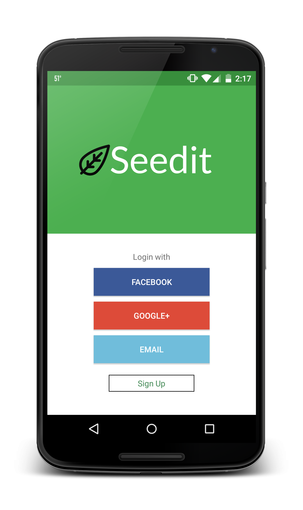
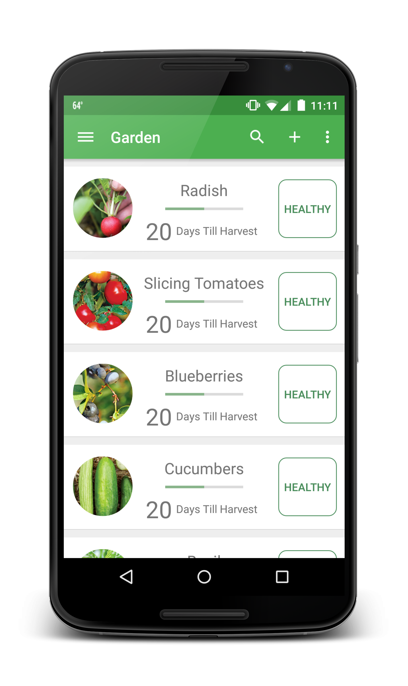
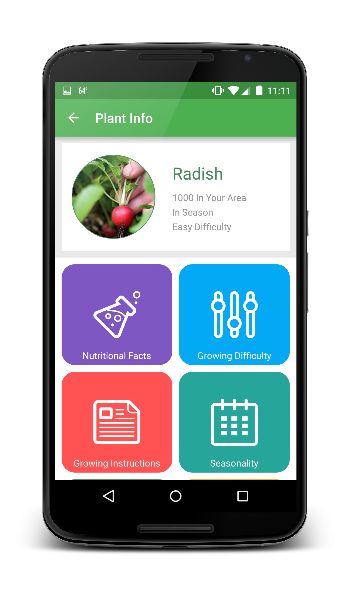
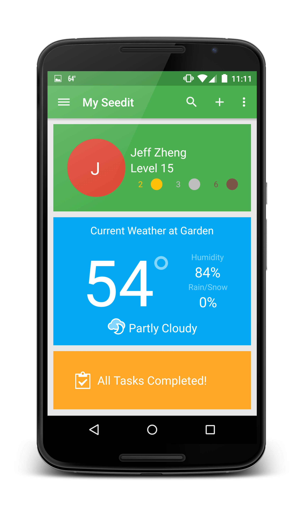

# Seedit

Seedit was an Android application designed for [Citrus's Mobile App Challenge](http://mobileappchallenge.org/) .
The idea behind Seedit was to make a tool that simplifified gardening and make it accessible to a
wider demographic. The app has now been deprecated due to other projects that I am undertaking as
well as the fact that Parse is no longer supported. Feel free to fork this project if this concept
is interesting to you and make changes to the design or function of this application.

You can learn more about the application here at http://getseedit.herokuapp.com/.

MIT License

Copyright (c) 2016 Jeff Zheng

Permission is hereby granted, free of charge, to any person obtaining a copy
of this software and associated documentation files (the "Software"), to deal
in the Software without restriction, including without limitation the rights
to use, copy, modify, merge, publish, distribute, sublicense, and/or sell
copies of the Software, and to permit persons to whom the Software is
furnished to do so, subject to the following conditions:

The above copyright notice and this permission notice shall be included in all
copies or substantial portions of the Software.

THE SOFTWARE IS PROVIDED "AS IS", WITHOUT WARRANTY OF ANY KIND, EXPRESS OR
IMPLIED, INCLUDING BUT NOT LIMITED TO THE WARRANTIES OF MERCHANTABILITY,
FITNESS FOR A PARTICULAR PURPOSE AND NONINFRINGEMENT. IN NO EVENT SHALL THE
AUTHORS OR COPYRIGHT HOLDERS BE LIABLE FOR ANY CLAIM, DAMAGES OR OTHER
LIABILITY, WHETHER IN AN ACTION OF CONTRACT, TORT OR OTHERWISE, ARISING FROM,
OUT OF OR IN CONNECTION WITH THE SOFTWARE OR THE USE OR OTHER DEALINGS IN THE
SOFTWARE.